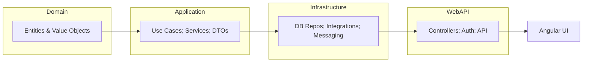

# Threat Monitor - A Real-Time Security Dashboard with ASP.NET Core & Angular

   

**Demo:** _Link to live demo when available_ 

## Description

Threat Monitor is a real-time security dashboard designed to detect, correlate, and visualize threats. Build with **ASP.NET Core** on the backend and **Angular** on the frontend, it is intended to integrate with agents, logs, and telemetry sources.

## Key Features

- Real-time event ingestion
- Alert correlation and prioritization
- Interactive dashboard for analysts
- PostgreSQL integration for historical storage
- Deployment with Docker and docker-compose

## Architecture

High-level diagram showing the four layers:

## Layers explained

- Domain: business models, rules and entities
- Application: use cases, orchestration, and contracts (services, DTOs)
- Infrastructure: repositories, external adapters, messaging, and persistence
- WebAPI: REST endpoints, authentication, and API versioning

## Technology Stack
- Backend: ASP.NET Core
- Frontend: Angular
- Database: PostgreSQL
- Containerization: Docker, docker-compose